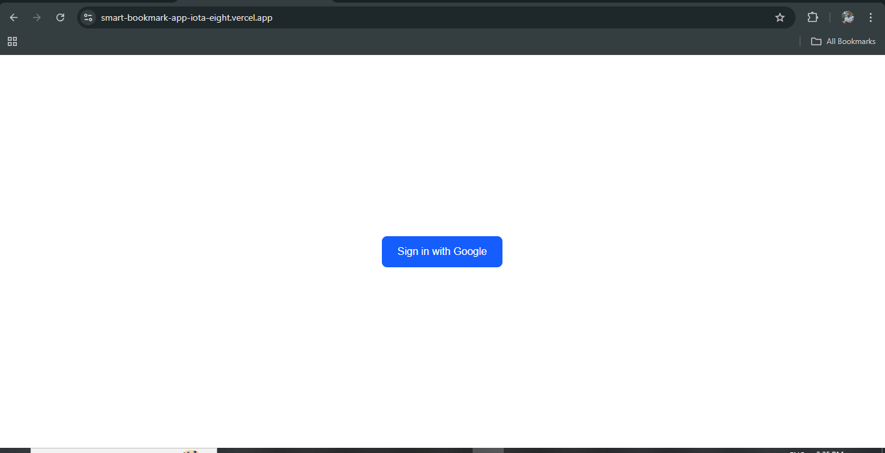
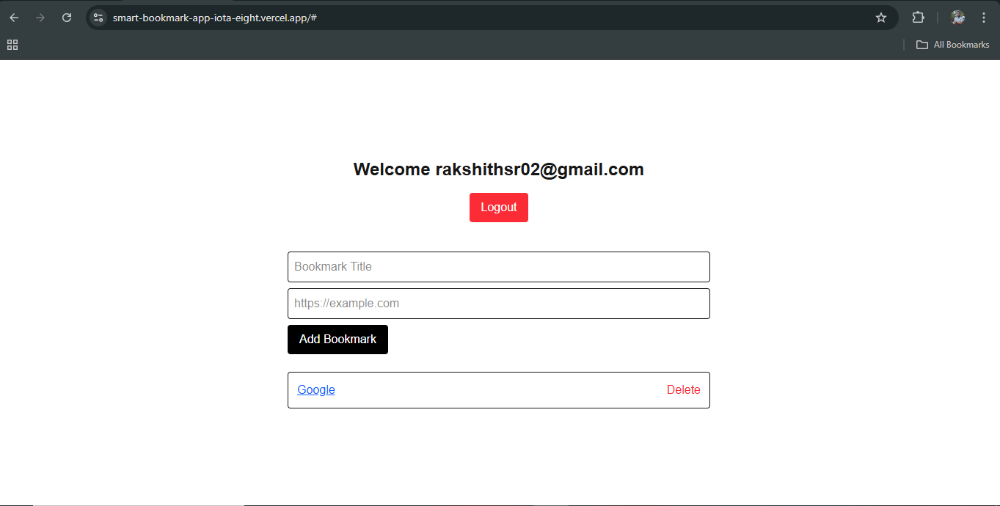
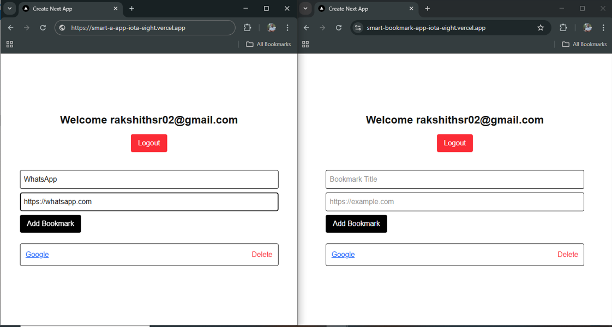
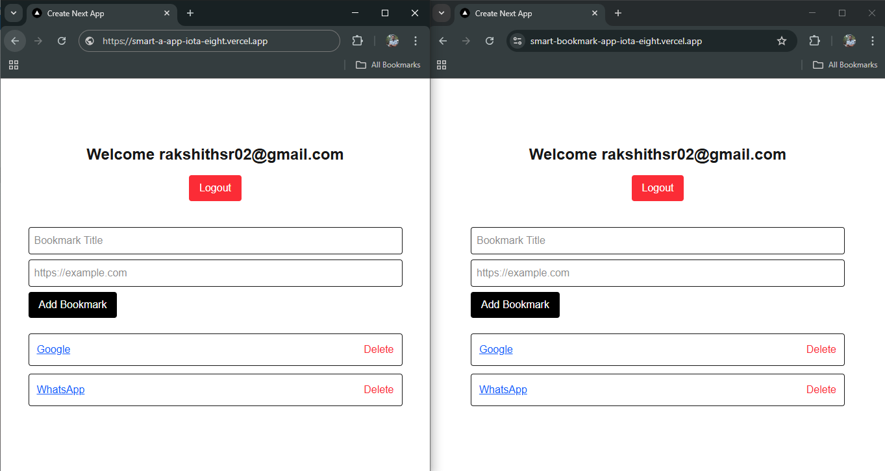
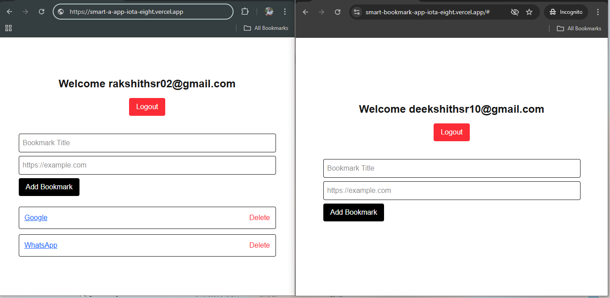

# 🚀 Smart Bookmark App

A production-ready full-stack bookmark manager built with secure multi-user architecture and realtime synchronization.

Built using:

- **Next.js (App Router)**
- **Supabase (Google OAuth, PostgreSQL, RLS, Realtime)**
- **Tailwind CSS**
- **Vercel (Deployment)**


## 🌐 Live Demo

🔗 Live URL: https://smart-bookmark-app-iota-eight.vercel.app/

---

# 📌 Features

## 1️. Google OAuth Authentication
- Login via **Google only** (no email/password)
- Secure Supabase Auth integration
- Session handling via `onAuthStateChange`
- Production-ready OAuth configuration

---

## 2️. Secure Multi-Tenant Architecture

Bookmarks are fully isolated per user using **Row Level Security (RLS)**.

Implemented database-level protection to ensure:

- Users can **view only their own bookmarks**
- Users can **insert only their own bookmarks**
- Users can **delete only their own bookmarks**

### Example RLS Policy:

```sql
auth.uid() = user_id
```

This ensures data isolation at the database level — not just frontend filtering.

---

## 3️. Realtime Updates (Cross-Tab Sync)

- Implemented using Supabase Realtime (`postgres_changes`)
- Adding a bookmark in one tab updates all open tabs instantly
- Deleting a bookmark reflects immediately
- Configured:

```sql
ALTER TABLE public.bookmarks REPLICA IDENTITY FULL;
```

This enables DELETE payload broadcasting.

---

## 4️. CRUD Operations

- Add Bookmark (Title + URL)
- Delete Bookmark
- User-isolated data access
- Secure multi-user environment tested with multiple Google accounts

---

# 🧠 Technical Architecture

## Frontend

- Next.js (App Router)
- Client Components
- Supabase JS SDK
- Tailwind CSS
- Realtime subscriptions via Supabase channels

## Backend

- Supabase PostgreSQL
- Row Level Security (RLS)
- Realtime Publication
- Google OAuth Provider

---

# 🔐 Database Schema

Table: `bookmarks`

| Column     | Type                        |
|------------|-----------------------------|
| id         | uuid (Primary Key)          |
| user_id    | uuid (FK → auth.users.id)   |
| title      | text                        |
| url        | text                        |
| created_at | timestamptz                 |

**Replica Identity:** FULL  
**Realtime Publication:** Enabled  
**RLS:** Enabled  

---

# ⚠️ Challenges Faced & Solutions

## ❗ 1. Default vs Named Import Errors

**Error:**
```
Element type is invalid: expected a string or function but got object
```

**Cause:**  
Import/export mismatch or Next.js caching issue.

**Solution:**
- Corrected default exports
- Verified module paths
- Cleared `.next` cache folder
- Restarted development server

---

## ❗ 2. Realtime INSERT worked but DELETE did not

**Cause:**  
Postgres requires `REPLICA IDENTITY FULL` for DELETE payloads.

**Solution:**
```sql
ALTER TABLE public.bookmarks REPLICA IDENTITY FULL;
```

---

## ❗ 3. Supabase Dashboard not showing realtime changes

Clarification:  
Supabase dashboard is **not realtime**.  
Realtime events are received only by subscribed client applications.

---

## ❗ 4. Next.js Dev Lock Error

```
Unable to acquire lock at .next/dev/lock
```

**Solution:**
- Terminated existing Node process
- Deleted `.next` folder
- Restarted development server

---

# 🛠️ Running Locally

1. Clone the repository:

```bash
git clone https://github.com/Rakshithsr1997/smart-bookmark-app.git
```

2. Install dependencies:

```bash
npm install
```

3. Create a `.env.local` file in the root directory:

```env
NEXT_PUBLIC_SUPABASE_URL=your_project_url
NEXT_PUBLIC_SUPABASE_ANON_KEY=your_anon_key
```

4. Run development server:

```bash
npm run dev
```

Open:

```
http://localhost:3000
```

---

# 🚀 Deployment

- Hosted on Vercel
- Environment variables configured securely
- Production OAuth redirect URLs configured
- Multi-user isolation tested in production
- Realtime cross-tab behavior verified

---

# 📂 Repository Structure

```
src/
 ├── app/
 │    ├── layout.tsx
 │    ├── page.tsx
 ├── components/
 │    ├── LoginButton.tsx
 │    └── BookmarkManager.tsx
 ├── lib/
 │    └── supabaseClient.ts
```

---

# 🧪 Production Validation Checklist

- ✅ Google OAuth login works
- ✅ Insert bookmark
- ✅ Delete bookmark
- ✅ Realtime sync across tabs
- ✅ Multi-user isolation verified
- ✅ RLS enforced at database level
- ✅ No secrets committed (.env.local ignored)

---

# 👨‍💻 Author

**Rakshith SR**  
Full Stack Developer (Next.js, Supabase, Secure SaaS Architecture)

Built as part of a 72-hour Fullstack/GenAI micro-challenge.

---

# 🎯 Final Impression

This project demonstrates:

- Secure authentication architecture
- Database-level multi-tenant isolation
- Realtime systems integration
- Production deployment workflow
- Practical debugging and problem-solving skills


## 📸 Production Validation

### 1️.Google OAuth Login


---

### 2️.Dashboard After Login


---

### 3️.Realtime Multi-Tab (Before)


### 4️.Realtime Multi-Tab (After)


---

### 5️.Multi-User Isolation (RLS)
